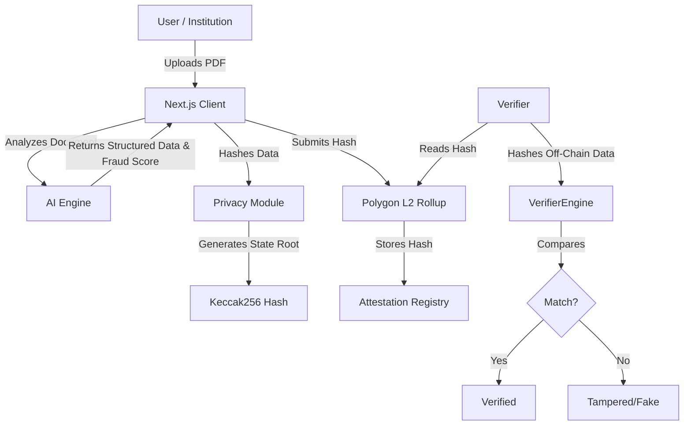

# AI-Backed Credential Attestation using L2 Rollups

## 1. Executive Summary
This document outlines the technical architecture for a privacy-preserving credential attestation system. The solution leverages **Artificial Intelligence (AI)** for automated document analysis and fraud detection, combined with **Layer 2 (L2) Rollups (Polygon)** for secure, scalable, and immutable on-chain anchoring.

## 2. System Architecture

The system operates on a hybrid **Off-Chain / On-Chain** model to ensure data privacy while maintaining cryptographic integrity.



## 3. The AI Layer (Automated Analysis)

The AI layer serves as the ingress point for raw credential data. It transforms unstructured files (PDFs/Images) into structured, verifiable constraints.

### Key Functions
1.  **OCR & Extraction**: intelligently extracts fields like `recipientName`, `recipientId`, and `degreeType` from diverse layouts.
2.  **Fraud Detection**: Analyzes visual artifacts (font consistency, layer manipulation) to generate a `confidenceScore` and `isFraudulent` flag.

### Implementation Reference
Located in `lib/ai-utils.ts`:
```typescript
export interface ExtractedDocumentData {
    recipientName?: string;
    recipientId?: string; // e.g., Student ID
    documentType?: string;
    confidenceScore: number; // 0.0 to 1.0
    isFraudulent: boolean;
}
```

## 4. Privacy & Hashing (The "Commitment")

To comply with **GDPR** and user privacy standards, **NO Personally Identifiable Information (PII)** is stored on the blockchain. Instead, we use a commitment scheme based on cryptographic hashing.

### Mechanism
1.  **Data Sorting**: Object keys are sorted to ensure deterministic output (canonicalization).
2.  **Hashing**: The structured data is hashed using `Keccak256`.

**Formula**:
$$ H = Keccak256(Sort(Json(Data))) $$

### Implementation Reference
Located in `lib/privacy-utils.ts`:
```typescript
// Generates the on-chain fingerprint
export function hashStudentData(data: PrivateStudentData): string {
    const sortedData = JSON.stringify(data, Object.keys(data).sort());
    return ethers.keccak256(ethers.toUtf8Bytes(sortedData));
}
```

## 5. Layer 2 Rollup Infrastructure

We utilize **Polygon Amoy** (testnet) as our Layer 2 solution.

### Why L2 Rollups?
1.  **Scalability**: Rollups bundle hundreds of attestations into a single proof submitted to Ethereum, reducing congestion.
2.  **Cost Efficiency**: Gas fees are negligible compared to Ethereum Mainnet, making high-volume credential minting viable.
3.  **Security**: Inherits the security properties of the underlying Ethereum L1.

### Configuration
The chain connection is managed via `wagmi` in `lib/config.ts`, targeting `Chain ID 80002` (Polygon Amoy).

## 6. End-to-End Workflow

### Step 1: Ingestion & Verification
The issuer uploads a document. The AI engine parses it and returns:
- **Data**: `{ Name: "Jane Doe", Degree: "B.Sc" }`
- **Safety**: `{ Confidence: 0.98, Fraud: false }`

### Step 2: Commitment Generation
The client confirms the data is correct and generates the hash:
- **Input**: `{ Name: "Jane Doe", Degree: "B.Sc" }`
- **Output (Hash)**: `0x7f83b165...`

### Step 3: Blockchain Anchoring
The client asks the user (Issuer) to sign a transaction sending `0x7f83b165...` to the Attestation Smart Contract on Polygon.

### Step 4: Verification
A third party wanting to verify the credential:
1. Receives the original PDF/JSON from the student (Off-chain).
2. Runs the local hash function on that data.
3. Queries the Smart Contract on Polygon for the existence of that specific hash.
4. **Success**: If the generated hash exists on-chain, the document is authentic and unmodified.
