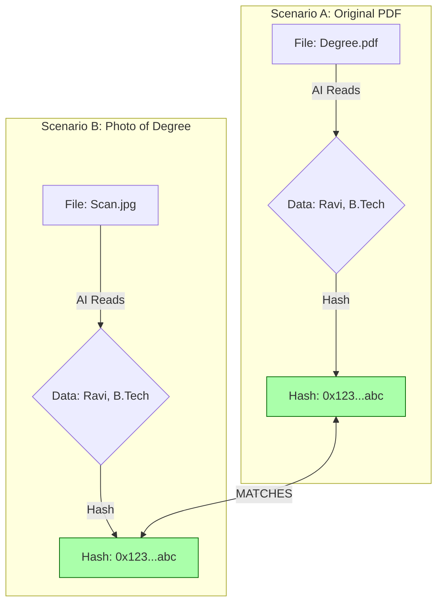
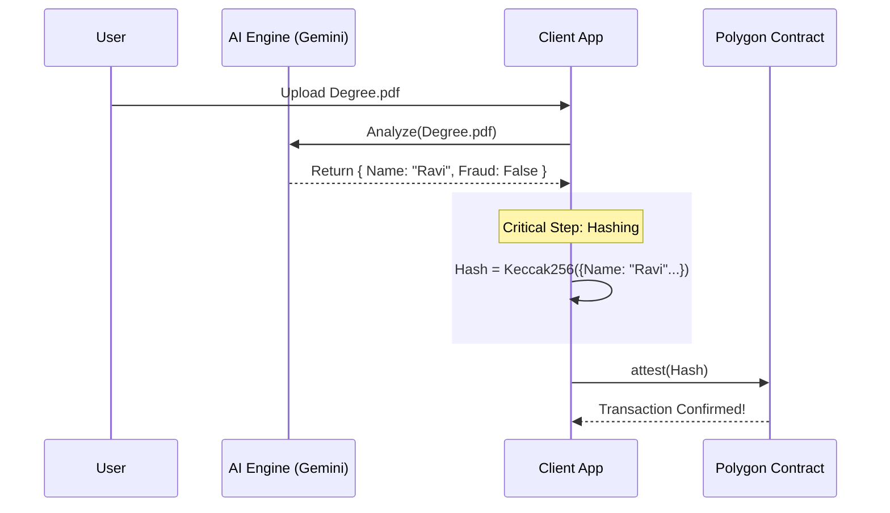
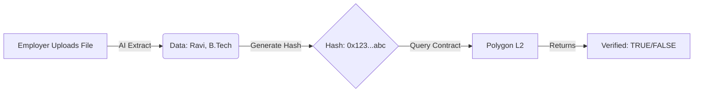

# Attestation Workflow & Hashing Deep Dive

This document clarifies exactly **how** we secure credentials, why we use AI, and how the Blockchain fits in.

## 1. The Core Concept: "Data Hashing" vs. "File Hashing"

The most common confusion is: *"Do we hash the PDF file?"*
**Answer: NO.**

### Why NOT hash the file? (The "File Hash" Problem)
If you hash the raw PDF file (SHA256), the hash changes if:
- You compress the PDF (e.g., WhatsApp compression).
- You take a screenshot (JPG) of the PDF.
- You print and scan it back in.
- You open and "Save As" (which changes metadata timestamps).

This makes the system **brittle**. A valid degree would fail verification just because it was saved as a different ecosystem format or compressed.

### Our Solution: "Data Hashing" (The "Semantic" Approach)
We use the AI to extract the **meaning** (Data) from the file, and we hash *that*.
- **Input**: PDF, JPG, PNG (doesn't matter).
- **Extracted Data**: `{ Name: "Ravi", Degree: "B.Tech", Year: "2024" }`.
- **Hash**: `Keccak256(Extracted Data)`.

**Result**: As long as the *information* on the document is the same, the **Hash** is the same. This is robust.



---

## 2. The Full Workflow

Here is how the Attestation (Minting) and Verification flows work together.

### Step 1: Attestation (Issuing/Minting)
*Happens once, by the Student or Institution.*

1.  **Upload**: User uploads the document.
2.  **AI Analysis**: Gemini extracts data (`Name`, `Degree`) and checks for visual fraud (Photoshop edits).
3.  **Hashing**: We create a generic hash of the extracted data.
4.  **Blockchain**: We send this Hash to the Polygon Smart Contract (`attest(hash)`).



### Step 2: Verification (Employer/Third Party)
*Happens anytime, by anyone.*

1.  **Upload**: Employer uploads a *copy* (or photo) of the degree.
2.  **AI Extraction**: Gemini reads the data again from this new file.
3.  **Hashing**: We generate the hash of this data.
4.  **Blockchain Check**: We ask the contract: *"Does this hash exist?"*
5.  **Result**:
    *   **TRUE**: The document data matches what was anchored on-chain. **(Factually Correct)**
    *   **FALSE**: This document looks real, but the data was never attested. **(Fake/Lie)**



---

## 3. The "Dual Layer" Defense

We combine two checks to catch 100% of frauds.

| Layer | Technology | What it catches | Example |
| :--- | :--- | :--- | :--- |
| **1. Visual Layer** | **Generative AI** | **Tampering** | User used Photoshop to change "B" grade to "A". Fonts look weird. Pixels are mismatched. |
| **2. Factual Layer** | **Polygon L2** | **Lying** | User created a *perfect* fake degree for "Medicine" (visually perfect), but they actually studied "Arts". The Hash won't exist on-chain. |

---

## 4. What Creates the Hash?
In our code (`lib/privacy-utils.ts`), we combine specific fields to ensure privacy and uniqueness.

**The Recipe:**
```typescript
const payload = {
    recipientName: "Jane Doe",
    recipientId: "STU-123",     // Unique ID ensures two "Jane Does" don't clash
    documentType: "B.Tech",
    // We do NOT include timestamp or randomness, to ensure determinstic hashing.
};

const hash = Keccak256(JSON.stringify(sort(payload)));
```

## 5. What is Left to Do?
We have built the **Client** and the **AI Integration**. The puzzle pieces remaining are:

1.  **Smart Contract Deployment**:
    *   Currently, we have a generic `hooks/use-attestation.ts` pointing to a placeholder address.
    *   **Next Step**: We need to actually deploy a simple Solidity contract to Polygon Amoy to make the `writeContract` call really work.

2.  **Verification UI**:
    *   Currently, the "Action Zone" does both. We might want a specific "Employer Mode" toggle that only checks (reads) instead of mints (writes).

3.  **Production Polish**:
    *   Better error handling if AI fails (retries).
    *   Loading states for wallet signatures.
