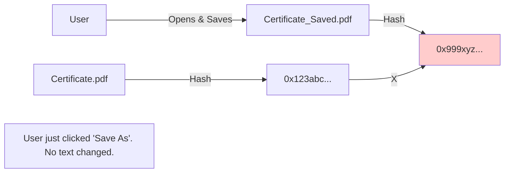
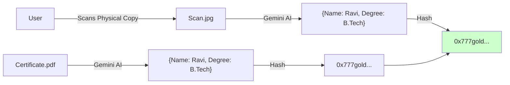

# The Golden Rule: Hash the Data, Not the File

You asked: **"So we [are] hashing the extracted data - not the document itself?"**

**ANSWER: YES! 100% Correct.**

Here is why this distinction saves the entire project.

## 🔴 Approach A: Hashing the File (The "Brittle" Way)
If you hash the PDF file itself (`SHA256(certificate.pdf)`):

**Result**: **FAIL**. Even a tiny invisible change (metadata, creation date) changes the hash. The blockchain says "Fake Document" even though the data is true.

---

## 🟢 Approach B: Hashing the Data (The "Robust" Way)
This is what we are doing. We extract the **Meaning** (Data) and hash that.

**Result**: **SUCCESS**. As long as the *facts* (Name, Degree) are the same, the hash is the same. This allows the user to have a PDF, a Scan, or a Xerox, and it still verifies on-chain.
