# Why Gemini? A Beginner's Guide to AI in Blockchain

Think of a **Blockchain** like a very strict math teacher. It only accepts *exact* answers. If you write "Maths" instead of "Mathematics", it rejects it.

Think of a **PDF Certificate** like a messy handwritten note. It has logos, different fonts, watermarks, and pixels.

The problem is: **The strict Blockchain cannot read the messy PDF.**

---

## 1. What is Gemini's Job? (The "Translator")

We use Google Gemini as a **Universal Translator**.

*   **Input**: You give Gemini the messy PDF (image/pixels).
*   **Job**: Gemini looks at it and extracts *only* the specific facts we need (Name, Degree, ID).
*   **Output**: It gives us a clean, computer-readable list (JSON).

**Analogy**:
Imagine you are at a noisy party (The PDF) and you need to whisper a secret code to a guard (The Blockchain). Gemini is the friend who listens to the noise, filters out the music, and tells you *exactly* what the secret code is so you can whisper it to the guard.

---

## 2. Where does it live?

In our code, it lives in one specific file: `lib/ai-utils.ts`.

It sits right in the middle between the **User** and the **Blockchain**:

```mermaid
graph LR
    User[Student] -->|Uploads PDF| Gemini[🤖 Google Gemini]
    Gemini -->|Extracts Facts| Code[Our App]
    Code -->|Creates Fingerprint| Blockchain[Polygon Network]
```

---

## 3. How do we implement it? (The Steps)

Here is the recipe we will follow:

### Step 1: The "Eyes" (Input)
We take the file the user uploaded. We don't try to read it ourselves. We just pass the whole file to Gemini.

### Step 2: The "Prompt" (Instruction)
We tell Gemini: *"Look at this image. Find the Student Name and Degree. Do not give me any extra words. Just give me the data."*

### Step 3: The "Cleanup" (Normalization)
Gemini replies: `{ "Name": "Ravi Kumar", "Degree": "B.Tech" }`.
Now we have clean text!

### Step 4: The "Fingerprint" (Hashing)
We take that clean text and turn it into a mathematical fingerprint (Hash). This fingerprint goes to the blockchain.

---

## 4. Viability & Considerations

| Question | Answer |
| :--- | :--- |
| **Is it expensive?** | **No.** Google Gemini has a "Free Tier" that allows us to send 15 documents per minute for free. |
| **Is it hard to code?** | **No.** It is about 10 lines of code. It's easier than writing a loop. |
| **Is it accurate?** | **Yes.** Because Gemini is "trained" on billions of documents, it understands what a "Degree Certificate" looks like better than most humans. |

### Why not just type the name manually?
Technically, you *could*. But that allows users to lie. By forcing them to upload the PDF, and having AI read it, we verify that the **document actually says what they claim it says**.
