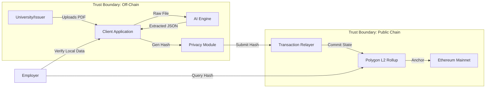
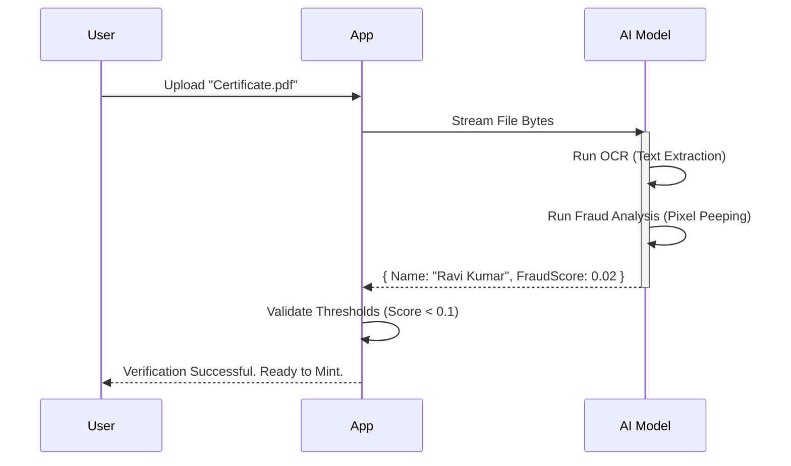
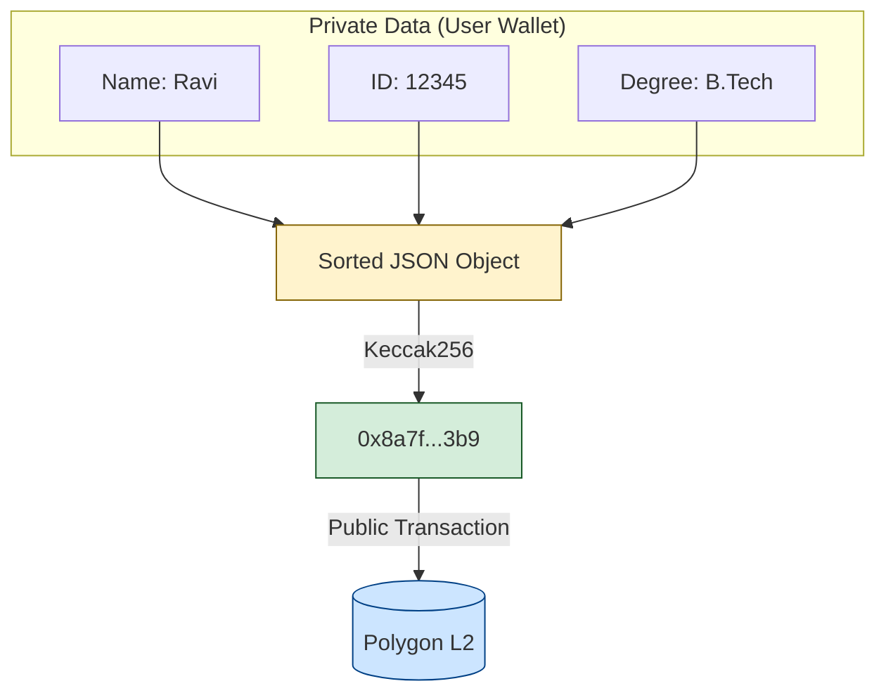
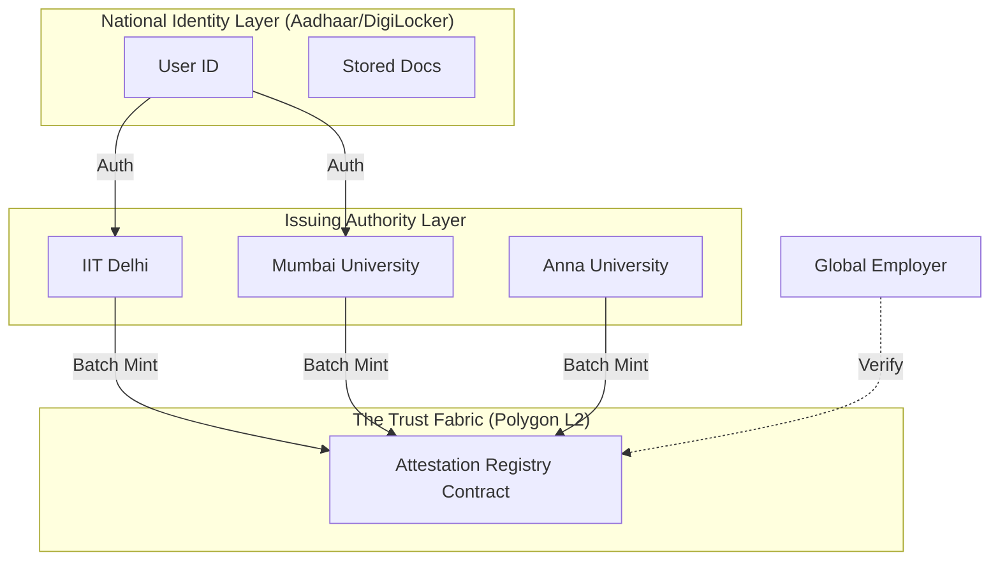

# The Verifiable Ledger: A Framework for AI-Augmented Credential Attestation via Layer 2 Rollups

**Date:** December 11, 2025  
**Project:** CertifyChain (Proposed National Infrastructure)  
**Authors:** Digital Trust Initiative  

---

## Abstract

In an era of rampant digital forgery, the integrity of academic and professional credentials is paramount. This paper proposes a novel framework, **CertifyChain**, which integrates **Artificial Intelligence (AI)** for automated document analysis with **Ethereum Layer 2 (L2) Rollups** for immutable, privacy-preserving attestation. By decoupling the verification logic (AI) from the trust anchor (Blockchain), we achieve a scalable system capable of servicing national populations while ensuring zero leakage of Personally Identifiable Information (PII). We present the architecture, cryptographic mechanisms, and a roadmap for adoption within India's digital public infrastructure.

---

## 1. Introduction

The traditional credentialing ecosystem is fragmented and paper-based, leading to inefficiencies and fraud. Verification often requires manual back-and-forth between employers and issuing institutions. 

Our solution introduces a **Digital Trust Protocol** where:
1.  **Issuance is Digital & Physical**: Documents exist as PDF/Images but are anchored digitally.
2.  **Verification is Instant**: Mathematical certainty replaces manual checks.
3.  **Privacy is Absolute**: No user data touches the public ledger.

---

## 2. System Architecture

The system is architected as a coherent triad: The **Client (Ingestion)**, the **AI Oracle (Validation)**, and the **L2 Ledger (immutability)**.

### Figure 1: High-Level System Topology

The separating line between "Off-Chain" and "Public Chain" is critical. It represents the **Privacy Firewall**. Only cryptographic commitments (hashes) cross this line.

---

## 3. The AI Verification Layer

The "AI Oracle" replaces the human registrar. Using Large Language Models (LLMs) and Optical Character Recognition (OCR), the system extracts structured data from unstructured artifacts.

### 3.1 The Extraction Pipeline

1.  **Ingestion**: High-resolution scan/PDF upload.
2.  **Segmentation**: Identifying regions of interest (Name, Degree, Date).
3.  **Feature Extraction**: Converting pixels to text.
4.  **Forensic Analysis**: Detecting font inconsistencies or layer manipulation (Fraud Detection).

### Figure 2: AI Processing Logic

---

## 4. Cryptographic Privacy Preservation

We utilize a **Commitment Scheme** to ensure privacy. The raw data (Name, ID, Degree) is never stored on-chain. Instead, we store a **State Root** derived from the data.

### 4.1 The Hashing Interaction

Let $D$ be the student data object. We define a hashing function $H$ (Keccak256) such that:

$$ S = H(Canonicalize(D)) $$

Where $S$ is the State Root. 
- **Pre-image Resistance**: Given $S$, it is computationally infeasible to find $D$.
- **Collision Resistance**: No two distinct data sets $D_1$ and $D_2$ will produce $S$.

### Figure 3: The Privacy Commitment

---

## 5. Scaling with Layer 2 Rollups

We deploy on **Polygon**, an Ethereum L2 scaling solution. This choice is driven by the "Trilemma" solution:
1.  **Security**: Derived from Ethereum via checkpoints.
2.  **Scalability**: 65,000+ TPS (Transactions Per Second) theoretical throughput.
3.  **Cost**: Fractions of a cent per attestation, critical for developing economies.

**Smart Contract Logic**:
The contract acts as a simple registry `mapping(bytes32 => bool)`. It answers only one question: *"Has this hash been seen before?"*

---

## 6. Project "BharatChain": A National Implementation Strategy

To implement this across **India**, we propose integrating with the **India Stack**.

### 6.1 Integration with DigiLocker
- **Current State**: DigiLocker stores PDFs.
- **Proposed State**: DigiLocker stores the *Salt* and *Data* required to regenerate the on-chain hash, providing a bridge between Web2 (Centralized) and Web3 (Decentralized).

### 6.2 The Unified Ledger
All universities (IITs, NITs) act as **Nodes** or **Authorized Signers** on the permissioned layer of the network, while verification remains public.

### Figure 4: National Infrastructure Map

### 6.3 Use Cases
1.  **Academic Degrees**: Instant verification for higher education.
2.  **Skill Certificates**: Micro-credentials for vocational training.
3.  **Land Records**: Immutable history of property ownership.

---

## 7. Conclusion

The convergence of AI for semantic understanding and Blockchain for immutable record-keeping offers a robust solution to the credential crisis. By adopting this **L2-based Attestation Framework**, nations can leapfrog legacy paper bureaucracies, creating a frictionless, transparent, and trusted digital economy.

---
*Generated for the CertifyChain Project.*
